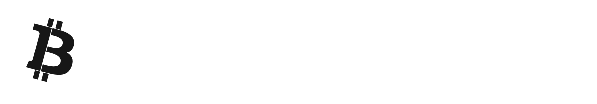

# ChainGraph





ChainGraph is an open-source flow-based programming platform that redefines how complex AI systems are built. Primarily aimed at developing AI LLM agents with elaborate logical flows, this framework combines a graph-based design with a strong emphasis on type safety—thanks to modern TypeScript features. Whether you’re crafting custom nodes or orchestrating dynamic, multi-step agent interactions, ChainGraph’s modular architecture supports your efforts with rigorous compile-time assurances and enhanced developer ergonomics.

> **Disclaimer:** This version is intended for demonstration and experimentation purposes only. The API and internal architecture are still evolving, and breaking changes may occur as new features are added and improvements are made.

---

## Features

- **Type-Safe Port System:** Supports a rich variety of port types including primitive (string, number, boolean) and complex (array, object, stream) with configurable validations.
- **Modular Node Architecture:** Create nodes with flexible decorators and metadata that make it simple to design, reuse, and extend custom nodes.
- **Dynamic Flow Execution:** Manage data propagation between nodes with a built-in execution engine that supports concurrent execution, debugging, and event subscriptions.
- **Real-Time API:** Powerful, end-to-end typesafe API built with tRPC, enabling real-time subscriptions and live updates.
- **Modern Tools & Runtime:** Leverages Bun for optimum performance and modern build tools, along with Zod for runtime validation and SuperJSON for serialization.

---

## Project Structure

The repository is organized as a monorepo with multiple packages:

- **packages/chaingraph-types:** Contains shared types, interfaces, and utilities for ports, nodes, flows, edges, and more.
- **packages/chaingraph-nodes:** A collection of sample nodes and node categories demonstrating how to build custom functionality.
- **packages/chaingraph-backend:** The backend service implementing API endpoints using tRPC, flow execution management, and WebSocket support.
- **packages/chaingraph-frontend:** The front-end interface built with React, Vite, and Tailwind CSS to visualize and control flows.

---

## Getting Started

### Prerequisites

- **Node.js v22.12.0** (as defined in the `.nvmrc`)
- **Bun:** Used as the primary runtime and package manager.
- **Git:** For cloning the repository.

### Installation

1. **Clone the Repository:**

   ```sh
   git clone https://github.com/badaitech/chaingraph.git
   cd chaingraph
   ```

2. **Install Dependencies:**

   Use the provided Makefile target (this will install dependencies for all packages):

   ```sh
   make install
   ```

   Alternatively, you can use Bun directly from the repository root:

   ```sh
   bun install
   ```

### Running in Development Mode

The project provides a unified development command that starts both the backend and frontend.

```sh
make dev
```

This command launches the frontend development server and the backend in watch mode. If needed, you can also run individual package scripts:

- **Backend:**
  ```sh
  bun run --cwd packages/chaingraph-backend dev
  ```
- **Frontend:**
  ```sh
  bun run --cwd packages/chaingraph-frontend dev
  ```

### Running Tests

To run tests across all packages:

```sh
make test
```

For a test with code coverage:

```sh
make test:coverage
```

### Building for Production

Build the entire project with:

```sh
make build
```

For a full rebuild (cleaning up previous artifacts first):

```sh
make rebuild
```

---

## Important Files

- **Makefile:** Contains scripts for cleaning, installing dependencies, building packages, running tests, and starting the development environment.
- **.nvmrc:** Specifies the Node.js version (v22.12.0) required for the project.
- **.gitignore:** Lists files and directories to be ignored by Git.

---

## Current Limitations & Work-In-Progress

- **Unstable API:** Because ChainGraph is still in active development, many aspects of the API may change and documentation might be updated accordingly.
- **Incomplete Features:** Some advanced features are still under development.
- **Experimental Design:** The current version is primarily for demonstration and evaluation purposes. It is not yet ready for production use.

---

## Contributing

Contributions are welcome! If you would like to help improve ChainGraph:
- Please open issues or pull requests with suggestions, bug reports, or improvements.
- Make sure to update or add documentation where necessary.
