# ChainGraph Decorator Specification Reference

## Table of Contents

- [Introduction](#introduction)
- [Node Decorators](#1-node-decorators)
  - [@Node](#node)
- [Property Decorators](#2-property-decorators)
  - [Direction Decorators](#direction-decorators)
    - [@Input](#input)
    - [@Output](#output)
  - [Port Metadata Decorators](#port-metadata-decorators)
    - [@Id](#id)
    - [@Name](#name)
    - [@Title](#title)
    - [@Description](#description)
    - [@DefaultValue](#defaultvalue)
    - [@Metadata](#metadata)
- [Scalar Port Decorators](#3-scalar-port-decorators)
  - [@String](#string)
  - [@Number](#number)
  - [@Boolean](#boolean)
- [Complex Port Decorators](#4-complex-port-decorators)
  - [@PortObject & @ObjectSchema](#portobject--objectschema)
    - [@ObjectSchema](#objectschema)
    - [@PortObject](#portobject)
  - [@PortArray & Array Helpers](#portarray--array-helpers)
    - [@PortArray](#portarray)
    - [Array Helper Decorators](#array-helper-decorators)
      - [@PortArrayString](#portarraystring)
      - [@PortArrayNumber](#portarraynumber)
      - [@PortArrayBoolean](#portarrayboolean)
      - [@PortArrayObject](#portarrayobject)
      - [@PortArrayNested](#portarraynested)
  - [@PortEnum & Enum Helpers](#portenum--enum-helpers)
    - [@PortEnum](#portenum)
    - [Enum Helper Decorators](#enum-helper-decorators)
      - [@StringEnum](#stringenum)
      - [@NumberEnum](#numberenum)
      - [@PortEnumFromObject](#portenumfromobject)
      - [@PortEnumFromNative](#portenumfromnative)
  - [@PortStream](#portstream)
  - [@PortAny](#portany)
- [Common UI Configuration Properties](#5-common-ui-configuration-properties)
- [Port Type-Specific UI Properties](#6-port-type-specific-ui-properties)
  - [String Port UI](#string-port-ui)
  - [Number Port UI](#number-port-ui)
  - [Array Port UI](#array-port-ui)
  - [Object Port UI](#object-port-ui)
- [Complete Examples](#7-complete-examples)
  - [Basic Node with Scalar Ports](#basic-node-with-scalar-ports)
- [Best Practices](#8-best-practices)
  - [Organization of Decorators](#organization-of-decorators)
  - [Object Schema Definitions](#object-schema-definitions)
  - [Default Values](#default-values)

## Introduction

This document provides a comprehensive specification of all decorators available in the ChainGraph framework. It serves as the definitive reference for all decorator properties, types, and configuration options.

ChainGraph decorators are used to:

- Define nodes and their metadata
- Configure node properties as ports
- Specify port data types, validation rules, and UI behavior
- Create complex object schemas for structured data

### How to Use This Reference

Each decorator section includes:

- **Purpose**: What the decorator is used for
- **Target**: What TypeScript elements it can be applied to
- **Properties**: Complete list of supported properties and their types
- **Examples**: Code snippets demonstrating proper usage
- **UI Visualization**: Where applicable, guidance on how properties affect visual representation

## 1. Node Decorators

### @Node

Creates a node class that can be registered and used in ChainGraph flows.

**Target:** Class

**Properties:**

| Property    | Type           | Required | Default | Description                                |
| ----------- | -------------- | -------- | ------- | ------------------------------------------ |
| title       | string         | Yes      | -       | Display name of the node                   |
| description | string         | No       | -       | Detailed description of the node's purpose |
| category    | string         | No       | "other" | Category grouping for the node             |
| icon        | string         | No       | -       | Icon identifier for node visualization     |
| tags        | string[]       | No       | []      | Keywords for node searchability            |
| author      | string         | No       | -       | Author of the node                         |
| version     | number         | No       | 1       | Node version number                        |
| ui          | NodeUIMetadata | No       | -       | UI styling and positioning properties      |

**Example:**

```typescript
@Node({
  title: 'Message Creator',
  description: 'Creates a new message with the specified content',
  category: 'messaging',
  tags: ['message', 'create', 'content'],
})
export class CreateMessageNode extends BaseNode {
  // Node properties defined here
}
```

**NodeUIMetadata Properties:**

| Property   | Type                                                                    | Description            |
| ---------- | ----------------------------------------------------------------------- | ---------------------- |
| position   | { x: number, y: number }                                                | Position in the canvas |
| dimensions | { width: number, height: number }                                       | Node dimensions        |
| style      | { backgroundColor?: string, borderColor?: string }                      | Visual styling         |
| state      | { isSelected?: boolean, isHighlighted?: boolean, isDisabled?: boolean } | UI state               |

## 2. Property Decorators

### Direction Decorators

#### @Input

Marks a property as an input port.

**Target:** Property

**Example:**

```typescript
@Input()
@String()
message: string = '';
```

#### @Output

Marks a property as an output port.

**Target:** Property

**Example:**

```typescript
@Output()
@String()
result: string = '';
```

### Port Metadata Decorators

These decorators add metadata to ports but don't affect their data types.

#### @Id

Sets a custom identifier for a port.

**Target:** Property
**Properties:**

| Parameter | Type   | Required | Description            |
| --------- | ------ | -------- | ---------------------- |
| portId    | string | Yes      | Custom ID for the port |

**Example:**

```typescript
@Id('user_status')
@String()
status: string = 'active';
```

#### @Name

Provides a custom name for a port.

**Target:** Property
**Properties:**

| Parameter | Type   | Required | Description                      |
| --------- | ------ | -------- | -------------------------------- |
| portName  | string | Yes      | Custom display name for the port |

**Example:**

```typescript
@Name('User Message')
@String()
message: string = '';
```

#### @Title

Sets a title for a port.

**Target:** Property
**Properties:**

| Parameter | Type   | Required | Description             |
| --------- | ------ | -------- | ----------------------- |
| title     | string | Yes      | Title text for the port |

**Example:**

```typescript
@Title('Message Content')
@String()
content: string = '';
```

#### @Description

Adds a description to a port.

**Target:** Property
**Properties:**

| Parameter       | Type   | Required | Description                   |
| --------------- | ------ | -------- | ----------------------------- |
| portDescription | string | Yes      | Description text for the port |

**Example:**

```typescript
@Description('Enter the message content to be sent')
@String()
content: string = '';
```

#### @DefaultValue

Specifies a default value for a port.

**Target:** Property
**Properties:**

| Parameter | Type | Required | Description                |
| --------- | ---- | -------- | -------------------------- |
| value     | T    | Yes      | Default value for the port |

**Example:**

```typescript
@DefaultValue('Hello World')
@String()
greeting?: string;
```

#### @Metadata

Adds arbitrary metadata key/value pairs to a port.

**Target:** Property
**Properties:**

| Parameter | Type   | Required | Description    |
| --------- | ------ | -------- | -------------- |
| key       | string | Yes      | Metadata key   |
| value     | any    | Yes      | Metadata value |

**Example:**

```typescript
@Metadata('ui:widget', 'status-indicator')
@String()
status: string = 'active';
```

## 3. Scalar Port Decorators

### @String

Defines a port with string data type.

**Target:** Property
**Properties:**

| Property     | Type                   | Required | Default | Description                               |
| ------------ | ---------------------- | -------- | ------- | ----------------------------------------- |
| defaultValue | string                 | No       | ''      | Default string value                      |
| minLength    | number                 | No       | -       | Minimum string length                     |
| maxLength    | number                 | No       | -       | Maximum string length                     |
| pattern      | string                 | No       | -       | Regular expression pattern for validation |
| ui           | StringPortConfigUIType | No       | -       | UI configuration options                  |

**Example:**

```typescript
@Input()
@String({
  defaultValue: 'Hello World',
  minLength: 1,
  maxLength: 100,
  pattern: '^[A-Za-z ]+$'
})
greeting: string = 'Hello World'
```

**UI Configuration:**

| Property           | Type                                | Description                                |
| ------------------ | ----------------------------------- | ------------------------------------------ |
| isTextArea         | boolean                             | Render as multi-line text area             |
| isPassword         | boolean                             | Render as password field with masked input |
| textareaDimensions | { width?: number, height?: number } | Custom dimensions for textarea             |

---

<table>
<tr>
<td>

```typescript
@String()
greeting: string = 'Hello World'
```

</td>
<td>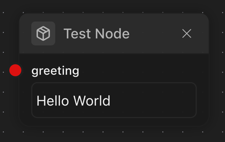</td>
</tr>

<tr>
<td>

```typescript
@String({
  ui: {
    isTextArea: true,
  }
})
greeting: string = 'Hello World'
```

</td>
<td>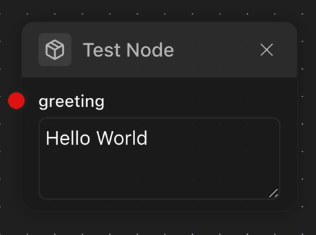</td>
</tr>

<tr>
<td>

```typescript
@String({
  ui: {
    isPassword: true,
  }
})
greeting: string = 'Hello World'
```

</td>
    <td> 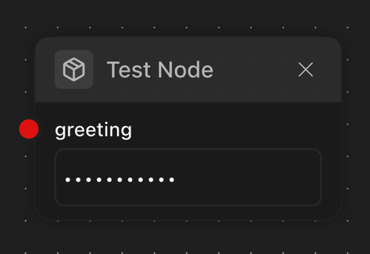</td>
</tr>

<tr>
<td>

```typescript
@String({
    ui: {
        hideEditor: true,
    },
})
greeting: string = 'Hello World'
```

</td>
    <td> 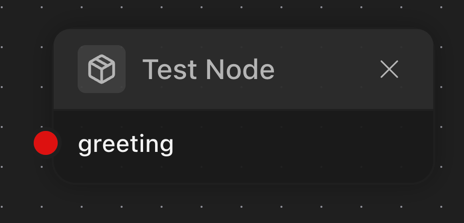</td>
</tr>

<tr>
<td>

```typescript
 @String({
    ui: {
        hidden: true,
    },
})
greeting: string = 'Hello World'
```

</td>
    <td> </td>
</tr>

<tr>
<td>

```typescript
 @String({
    ui: {
        hidePort: true,
    },
})
greeting: string = 'Hello World'
```

</td>
    <td> 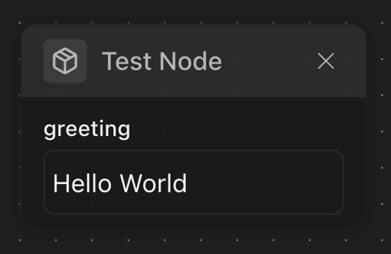</td>
</tr>

</table>

### @Number

Defines a port with numeric data type.

**Target:** Property
**Properties:**

| Property     | Type                   | Required | Default | Description                       |
| ------------ | ---------------------- | -------- | ------- | --------------------------------- |
| defaultValue | number                 | No       | 0       | Default numeric value             |
| min          | number                 | No       | -       | Minimum allowed value             |
| max          | number                 | No       | -       | Maximum allowed value             |
| step         | number                 | No       | -       | Step increment for UI controls    |
| integer      | boolean                | No       | false   | Whether only integers are allowed |
| ui           | NumberPortConfigUIType | No       | -       | UI configuration options          |

**Example:**

```typescript
@Input()
@Number({
  defaultValue: 42,
  min: 0,
  max: 100,
  step: 5,
  integer: true
})
quantity: number;
```

**UI Configuration:**

| Property         | Type    | Description                       |
| ---------------- | ------- | --------------------------------- |
| isSlider         | boolean | Render as slider control          |
| leftSliderLabel  | string  | Label for minimum value of slider |
| rightSliderLabel | string  | Label for maximum value of slider |

<table>
<tr>
<td>

```typescript
@Number()
greeting: number = 100
```

</td>
<td>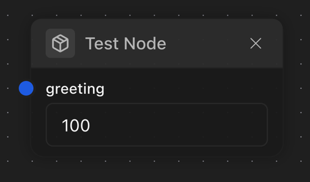</td>
</tr>

<tr>
<td>

```typescript
@Number({
  ui: {
    isSlider: true,
  },
})
greeting: number = 100
```

</td>
<td>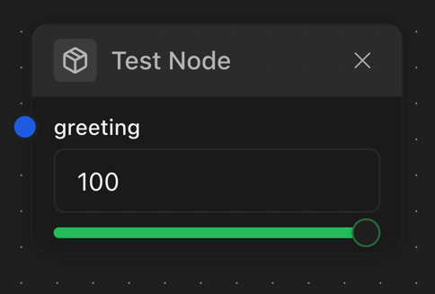</td>
</tr>

<tr>
<td>

```typescript
@Number({
  ui: {
    isSlider: true,
    leftSliderLabel: 'Low',
    rightSliderLabel: 'High',
  },
})
greeting: number = 100
```

</td>
    <td> 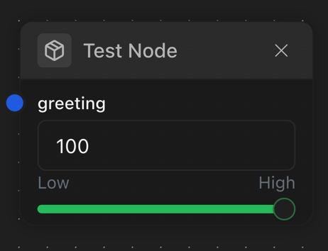</td>
</tr>
</table>

### @Boolean

Defines a port with boolean data type.

**Target:** Property
**Properties:**

| Property     | Type                    | Required | Default | Description              |
| ------------ | ----------------------- | -------- | ------- | ------------------------ |
| defaultValue | boolean                 | No       | false   | Default boolean value    |
| ui           | BooleanPortConfigUIType | No       | -       | UI configuration options |

**Example:**

<table>
<tr>
<td>

```typescript
@Input()
@Boolean({
    defaultValue: true,
})
isActive: boolean = true
```

</td>
<td></td>
</tr>

</table>

## 4. Complex Port Decorators

### @PortObject & @ObjectSchema

The Object port system allows defining complex structured data objects.

#### @ObjectSchema

Marks a class as an object schema.

**Target:** Class
**Properties:**

| Property    | Type   | Required | Default      | Description                      |
| ----------- | ------ | -------- | ------------ | -------------------------------- |
| description | string | No       | -            | Schema description               |
| category    | string | No       | -            | Schema category                  |
| id          | string | No       | -            | Custom identifier for the schema |
| type        | string | No       | [Class name] | Type identifier                  |

**Example:**

```typescript
@ObjectSchema({
  description: 'User profile data structure'
})
class UserProfile {
  @String({ minLength: 2 })
  name: string = 'Anonymous'

  @Number({ min: 18 })
  age: number = 21
}
```

#### @PortObject

Defines a port that accepts structured data.

**Target:** Property
**Properties:**

| Property        | Type                   | Required | Default | Description                                        |
| --------------- | ---------------------- | -------- | ------- | -------------------------------------------------- |
| schema          | Class\|IObjectSchema   | Yes      | -       | Object schema definition                           |
| defaultValue    | object                 | No       | {}      | Default object value                               |
| isSchemaMutable | boolean                | No       | false   | Whether properties can be added/removed at runtime |
| ui              | ObjectPortConfigUIType | No       | -       | UI configuration options                           |

**Example:**

```typescript
@Input()
@PortObject({
  schema: UserProfile,
  defaultValue: new UserProfile(),
  isSchemaMutable: true
})
profile: UserProfile;
```

**UI Configuration:**

| Property         | Type    | Description                        |
|------------------| ------- | ---------------------------------- |
| addKeyFormHidden | boolean | Hide the "Add Key" form            |
| collapsed        | boolean | Whether the object collapsed in UI |

<table>
<tr>
<td>

```typescript
@Input()
@PortObject({
    schema: UserProfile,
    ui: {
      collapsed: true,
    },
})
profile: UserProfile = new UserProfile()
```

</td>
<td>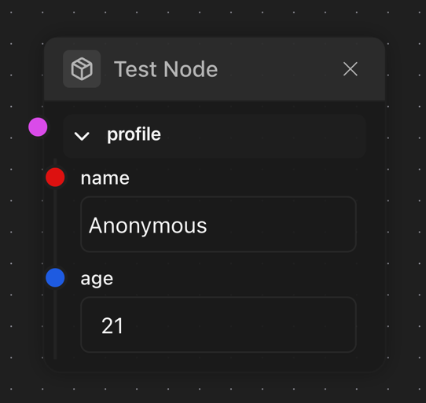</td>
</tr>

<tr>
<td>

```typescript
@Input()
@PortObject({
    schema: UserProfile,
    ui: {
      collapsed: false,
    },
})
profile: UserProfile = new UserProfile()
```

</td>
<td>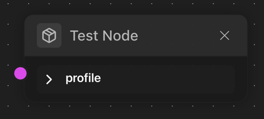</td>
</tr>

<tr>
<td>

```typescript
@Input()
@PortObject({
    schema: UserProfile,
    isSchemaMutable: true,
})
profile: UserProfile = new UserProfile()
```

</td>
<td>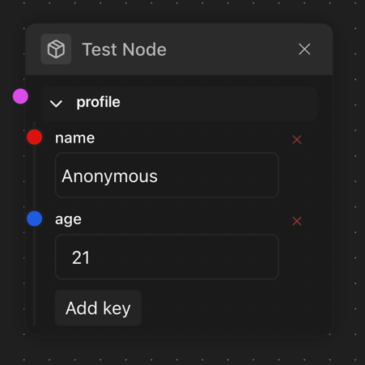</td>
</tr>

<tr>
<td>

```typescript
@Input()
@PortObject({
    schema: UserProfile,
    isSchemaMutable: true,
    ui: {
        keyDeletable: false,
    },
})
profile: UserProfile = new UserProfile()
```

</td>
<td>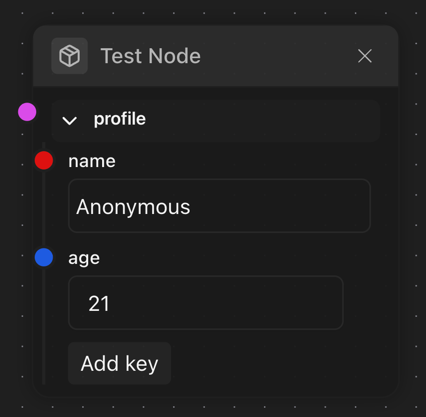</td>
</tr>

</table>

### @PortArray & Array Helpers

#### @PortArray

Defines a port that accepts array data.

**Target:** Property
**Properties:**

| Property     | Type                  | Required | Default | Description                   |
| ------------ | --------------------- | -------- | ------- | ----------------------------- |
| itemConfig   | IPortConfig           | Yes      | -       | Configuration for array items |
| defaultValue | array                 | No       | []      | Default array value           |
| minLength    | number                | No       | -       | Minimum array length          |
| maxLength    | number                | No       | -       | Maximum array length          |
| ui           | ArrayPortConfigUIType | No       | -       | UI configuration options      |

**Example:**

```typescript
@Input()
@PortArray({
  itemConfig: { type: 'string', minLength: 1 },
  defaultValue: ['item1', 'item2'],
  minLength: 1,
  maxLength: 10
})
tags: string[];
```

**UI Configuration:**

| Property                | Type    | Description                  |
| ----------------------- | ------- | ---------------------------- |
| addItemFormHidden       | boolean | Hide the "Add Item" form     |
| itemDeletable           | boolean | Allow deleting array items   |

[UI SCREENSHOT PLACEHOLDER: Array port with items and add item button]

#### Array Helper Decorators

ChainGraph provides convenient helper decorators for common array types:

##### @PortArrayString

For string arrays.

**Example:**

```typescript
@PortArrayString({ defaultValue: ['a', 'b'] })
tags: string[];
```

##### @PortArrayNumber

For number arrays.

**Example:**

```typescript
@PortArrayNumber({ defaultValue: [1, 2, 3] })
scores: number[];
```

##### @PortArrayBoolean

For boolean arrays.

**Example:**

```typescript
@PortArrayBoolean({ defaultValue: [true, false] })
flags: boolean[];
```

##### @PortArrayObject

For arrays of objects.

**Example:**

```typescript
@PortArrayObject(UserProfile, { defaultValue: [new UserProfile()] })
users: UserProfile[];
```

##### @PortArrayNested

For multi-dimensional arrays.

**Properties:**

| Property   | Type        | Required | Description                       |
| ---------- | ----------- | -------- | --------------------------------- |
| depth      | number      | Yes      | Number of nested array levels     |
| itemConfig | IPortConfig | Yes      | Configuration for innermost items |
| config     | object      | No       | Additional array configuration    |

**Example:**

```typescript
@PortArrayNested(2, { type: 'number', defaultValue: 0 })
matrix: number[][];
```

### @PortEnum & Enum Helpers

Enum ports allow selecting from a predefined set of options.

#### @PortEnum

**Target:** Property
**Properties:**

| Property     | Type                 | Required | Default | Description                    |
| ------------ | -------------------- | -------- | ------- | ------------------------------ |
| options      | IPortConfig[]        | Yes      | -       | Array of option configurations |
| defaultValue | string               | No       | -       | Default selected option ID     |
| ui           | EnumPortConfigUIType | No       | -       | UI configuration options       |

**Example:**

<table>
<tr>
<td>

```typescript
@Input()
@PortEnum({
    options: [
        {
            id: 'red',
            type: 'string',
            defaultValue: 'Red',
            title: 'Red'
        },
        {
            id: 'green',
            type: 'string',
            defaultValue: 'Green',
            title: 'Green'
        },
        {
            id: 'blue',
            type: 'string',
            defaultValue: 'Blue',
            title: 'Blue'
        },
    ],
})
color: string = 'red'
```

</td>
<td>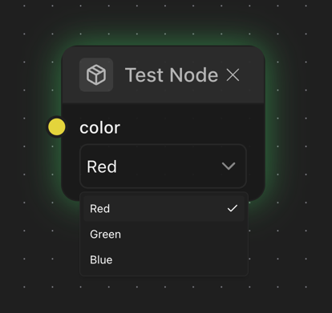</td>
</tr>

</table>

#### Enum Helper Decorators

##### @StringEnum

For string-based enums.

**Example:**

```typescript
@StringEnum(['Red', 'Green', 'Blue'], { defaultValue: 'Red' })
color: string;
```

##### @NumberEnum

For number-based enums.

**Example:**

```typescript
@NumberEnum([1, 2, 3], { defaultValue: '1' })
level: number;
```

##### @PortEnumFromObject

Creates an enum from an object mapping.

**Example:**

```typescript
const statusOptions = {
  active: new UserStatus('Active'),
  inactive: new UserStatus('Inactive'),
  pending: new UserStatus('Pending'),
};

@PortEnumFromObject(statusOptions, { defaultValue: 'active' })
status: keyof typeof statusOptions;
```

##### @PortEnumFromNative

Creates an enum from a native TypeScript enum.

**Example:**

```typescript
enum Direction {
  Up = 'Up',
  Down = 'Down',
  Left = 'Left',
  Right = 'Right',
}

@PortEnumFromNative(Direction, { defaultValue: Direction.Up })
direction: Direction;
```

### @PortStream

Defines a port that handles continuous data streams using the MultiChannel implementation.

**Target:** Property
**Properties:**

| Property     | Type                   | Required | Default | Description                    |
| ------------ | ---------------------- | -------- | ------- | ------------------------------ |
| itemConfig   | IPortConfig            | Yes      | -       | Configuration for stream items |
| defaultValue | MultiChannel           | No       | -       | Default stream channel         |
| ui           | StreamPortConfigUIType | No       | -       | UI configuration options       |

**Example:**

```typescript
@Input()
@PortStream({
  itemConfig: { type: 'string', minLength: 1 }
})
inputStream: MultiChannel<string> = new MultiChannel<string>();
```

### @PortAny

Defines a port that can accept any type of value, with optional type validation through an underlying type.

**Target:** Property
**Properties:**

| Property       | Type                 | Required | Default | Description                                 |
| -------------- | -------------------- | -------- | ------- | ------------------------------------------- |
| underlyingType | IPortConfig          | No       | -       | Optional configuration for value validation |
| defaultValue   | any                  | No       | null    | Default value                               |
| ui             | BasePortConfigUIType | No       | -       | UI configuration options                    |

**Example:**

```typescript
@Input()
@PortAny({
  underlyingType: { type: 'string', minLength: 1 },
  defaultValue: 'default'
})
dynamicInput: any;
```

## 5. Common UI Configuration Properties

All port types support a common set of UI configuration properties through the `ui` parameter:

| Property    | Type    | Applicable To | Description                                             |
| ----------- | ------- | ------------- | ------------------------------------------------------- |
| hidden      | boolean | All ports     | Hide the port entirely                                  |
| disabled    | boolean | All ports     | Disable user interaction with the port                  |
| hideEditor  | boolean | All ports     | Hide the editor while showing the port connection point |
| hidePort    | boolean | All ports     | Hide the port from the node display                     |
| bgColor     | string  | All ports     | Background color for the port handle (hex or CSS color) |
| borderColor | string  | All ports     | Border color for the port handle (hex or CSS color)     |

**Example:**

```typescript
@String({
  ui: {
    bgColor: '#e70d0d',
    borderColor: '#460707',
    disabled: false,
    hideEditor: false
  }
})
```

## 6. Port Type-Specific UI Properties

### String Port UI

| Property           | Type                                | Description                                                 |
| ------------------ | ----------------------------------- | ----------------------------------------------------------- |
| isTextArea         | boolean                             | Render as multi-line text area instead of single-line input |
| isPassword         | boolean                             | Render as password field with masked input                  |
| textareaDimensions | { width?: number, height?: number } | Custom dimensions for textarea                              |

### Number Port UI

| Property         | Type    | Description                                      |
|------------------|---------|--------------------------------------------------|
| isSlider         | boolean | Render as slider control instead of number input |
| leftSliderLabel  | string  | Label for minimum value of slider                |
| rightSliderLabel | string  | Label for maximum value of slider                |

### Array Port UI

| Property                | Type       | Description                                     |
| ----------------------- | ---------- | ----------------------------------------------- |
| addItemFormHidden       | boolean    | Hide the "Add Item" form                        |
| itemDeletable           | boolean    | Whether array items can be deleted              |
| allowedTypes            | PortType[] | Types allowed when adding new items             |

### Object Port UI

| Property               | Type       | Description                              |
|------------------------|------------|------------------------------------------|
| keyDeletable           | boolean    | Whether object properties can be deleted |
| collapsed              | boolean    | Whether the object port collapsed        |
| hidePropertyEditor     | boolean    | Whether object properties can be edited  |
| allowedTypes           | PortType[] | Types allowed when adding new properties |

## 7. Complete Examples

### Basic Node with Scalar Ports

```typescript
import type { ExecutionContext, NodeExecutionResult } from '@badaitech/chaingraph-types'
import {
  BaseNode,
  Boolean,
  Input,
  Node,
  Number,
  ObjectSchema,
  Output,
  String,
} from '@badaitech/chaingraph-types'
import { NODE_CATEGORIES } from '../categories'

@Node({
  title: 'Message Formatter',
  description: 'Formats a message with parameters',
  category: NODE_CATEGORIES.DATA,
  tags: ['formatting', 'text', 'message'],
})
class MessageFormatterNode extends BaseNode {
  @Input()
  @String({
    title: 'Message Template',
    description: 'Template with {placeholder} markers',
    defaultValue: 'Hello, {name}!',
    minLength: 1,
    ui: {
      isTextArea: true,
      textareaDimensions: { width: 200, height: 100 },
    }
  })
  template: string = 'Hello, {name}!'

  @Input()
  @String({
    title: 'Name',
    description: 'Name to insert in the template',
    defaultValue: 'World',
  })
  name: string = 'World'

  @Input()
  @Number({
    title: 'Repeat Count',
    description: 'Number of times to repeat the message',
    defaultValue: 1,
    min: 1,
    max: 10,
    integer: true,
    ui: {
      isSlider: true,
    }
  })
  repeatCount: number = 1

  @Input()
  @Boolean({
    title: 'Add Timestamp',
    description: 'Whether to add a timestamp to the message',
    defaultValue: false,
  })
  addTimestamp: boolean = false

  @Output()
  @String({
    title: 'Formatted Message',
    description: 'The resulting formatted message',
  })
  output: string = ''

  async execute(context: ExecutionContext): Promise<NodeExecutionResult> {
    let message = this.template.replace('{name}', this.name)

    if (this.addTimestamp) {
      message = `${message} [${new Date().toISOString()}]`
    }

    this.output = message.repeat(this.repeatCount)

    return {}
  }
}
```

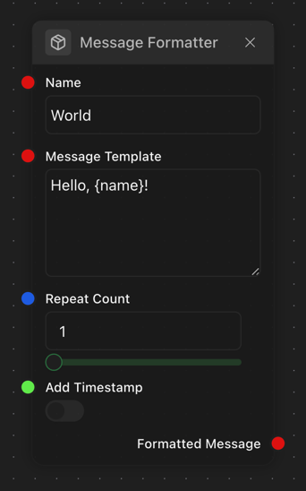

## 8. Best Practices

### Organization of Decorators

When applying multiple decorators to a property, follow this order for maximum readability:

1. Direction decorators (`@Input`, `@Output`)
2. Metadata decorators (`@Title`, `@Description`)
3. Type decorators (`@String`, `@Number`, etc.)

```typescript
@Input()
@Title('User Message')
@Description('Enter the message to be processed')
@String({
  minLength: 1,
  maxLength: 1000,
  ui: {
    isTextArea: true
  }
})
message: string = '';
```

### Object Schema Definitions

Define object schemas as separate classes rather than inline objects for better reusability and type safety:

```typescript
// Good practice:
@ObjectSchema()
class UserProfile {
  @String()
  name: string = '';

  @Number()
  age: number = 0;
}

@Input()
@PortObject({ schema: UserProfile })
user: UserProfile;

// Avoid:
@Input()
@PortObject({
  schema: {
    properties: {
      name: { type: 'string' },
      age: { type: 'number' }
    }
  }
})
user: any;
```

### Default Values

Always provide sensible default values, either in decorator configurations or as property initializers:

```typescript
// In decorator:
@String({ defaultValue: 'Default text' })
message?: string

// Or as property initializer:
@String()
message: string = 'Default text';
```

---

This specification document provides a comprehensive reference for all ChainGraph decorators and their configuration options. Use this as your guide when creating nodes, ports, and object schemas in your ChainGraph applications.
