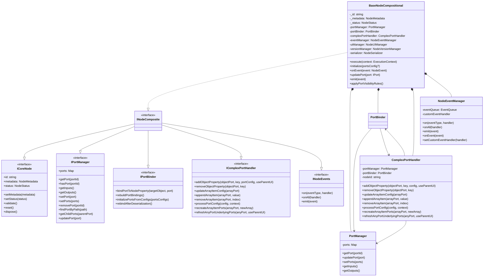
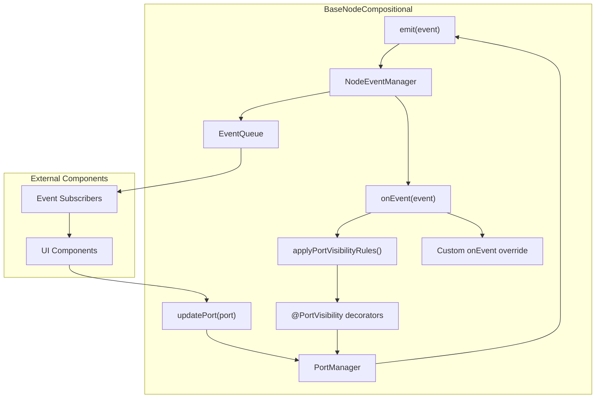
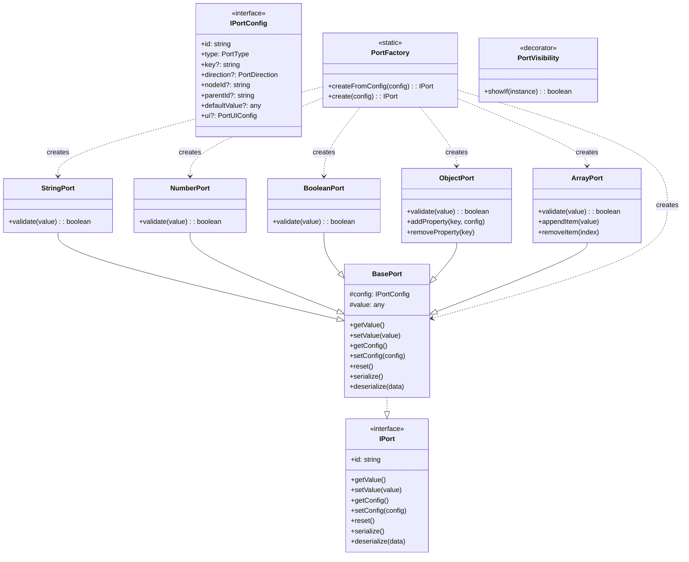
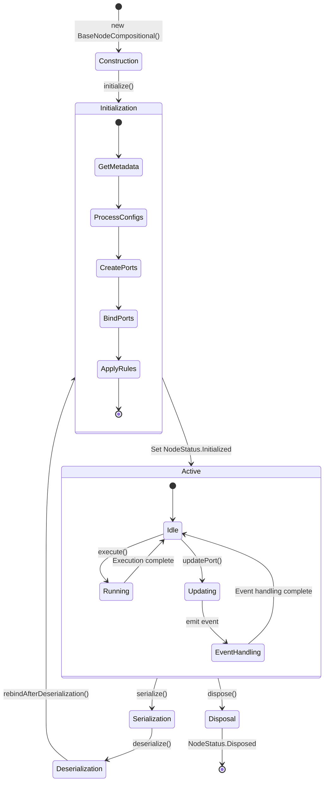
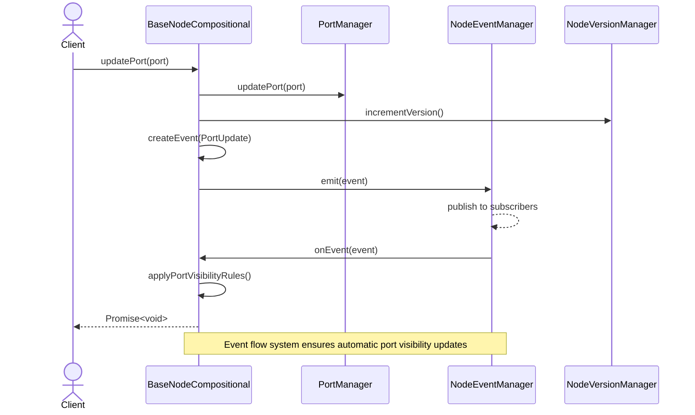

# Chaingraph Node Architecture

## Compositional Architecture Overview



## Event Flow System



## Port System Architecture



## Node Lifecycle



## Component Interaction



## Port Visibility System

```mermaid
flowchart LR
    Decorator["@PortVisibility decorator"]
    Rules["showIf conditions"]
    Storage["Visibility rules metadata"]
    
    PortUpdate["Port update event"]
    EventHandler["Node.onEvent()"]
    VisProcessor["applyVisibilityRules()"]
    PortConfig["port.ui.hidden property"]
    
    Decorator -->|stores| Storage
    Rules -->|defines| Storage
    
    PortUpdate -->|triggers| EventHandler
    EventHandler -->|calls| VisProcessor
    VisProcessor -->|reads| Storage
    VisProcessor -->|evaluates| Rules
    VisProcessor -->|updates| PortConfig
    
    style Decorator fill:#9b59b6,stroke:#8e44ad,color:white
    style Rules fill:#9b59b6,stroke:#8e44ad,color:white
    style Storage fill:#3498db,stroke:#2980b9,color:white
    style PortUpdate fill:#e74c3c,stroke:#c0392b,color:white
    style EventHandler fill:#e74c3c,stroke:#c0392b,color:white
    style VisProcessor fill:#3498db,stroke:#2980b9,color:white
    style PortConfig fill:#6ab04c,stroke:#218c74,color:white